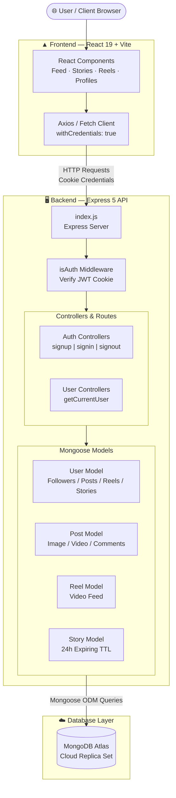

<div align="center">


### Next-generation social platform for sharing moments, reels, and stories in real-time


</div>

---

## About This Project

**Vistagram** is a production-grade full-stack social media platform engineered from the ground up to support modern community-driven interaction and media sharing. Inspired by industry-leading social networks, Vistagram seamlessly integrates content creation, social networking, media feeds, and robust authentication into a clean, modern monorepo setup.

### Core Features

- 👤 **User Profiles & Identity**: Account registration, secure authentication, customizable user profiles, avatars, and bios.
- 📸 **Content Sharing (Posts)**: High-resolution image and video posts with captions, likes, and comment threads.
- 🎥 **Short-Form Video (Reels)**: Dynamic video reels feed with engagement metrics.
- ⏳ **Ephemeral Content (Stories)**: 24-hour auto-expiring media stories powered by MongoDB TTL indexes.
- 🤝 **Social Graph**: Follower and following mechanisms to build personalized activity feeds.
- 💾 **Content Bookmarking**: Save favorite posts for quick offline reference.
- 🔐 **Secure Session Management**: HTTP-only JWT cookies for seamless and tamper-proof user authorization.

---

## Tech Stack

### Frontend

| Technology | Version | Purpose |
|---|---|---|
| **React** | ^19.2.7 | UI framework utilizing modern hooks and concurrent rendering |
| **Vite** | ^8.1.1 | Next-generation frontend build tooling with instant HMR |
| **Oxlint** | ^1.71.0 | High-performance JavaScript/JSX linter |
| **Vanilla CSS** | Standard | Custom styling and design tokens — zero heavy framework dependencies |

---

### Backend

| Package | Version | Purpose |
|---|---|---|
| **Express** | ^5.2.1 | Modern web framework (v5 with native async error routing) |
| **Mongoose** | ^9.8.0 | MongoDB ODM for schema modeling and relationship handling |
| **jsonwebtoken** | ^9.0.3 | Secure JSON Web Tokens for identity verification |
| **bcryptjs** | ^3.0.3 | Password hashing with salt factor 10 |
| **cookie-parser** | ^1.4.7 | Parse HTTP request cookies into accessible objects |
| **cors** | ^2.8.6 | Cross-Origin Resource Sharing configuration |
| **dotenv** | ^17.4.2 | Environment variable management |
| **nodemon** | ^3.1.14 | Development server live reload watcher |

---

### Database & Network Infrastructure

- **MongoDB Atlas**: Cloud-hosted NoSQL database storing users, posts, reels, and stories with auto-expiring TTL indexes.
- **Custom DNS Resolver**: Fallback DNS handling (`8.8.8.8`, `1.1.1.1`) inside `db.js` to eliminate `mongodb+srv://` SRV resolution failures in restricted local network setups.

---

## Project Structure

```text
Vistagram/
│
├── Frontend/
│   ├── public/
│   │   ├── favicon.ico
│   │   └── icons.svg                # SVG icons asset bundle
│   ├── src/
│   │   ├── App.jsx                  # Main UI layout & components
│   │   ├── App.css                  # Component-specific styles
│   │   ├── index.css                # Global CSS variables & resetting
│   │   ├── main.jsx                 # React root entry point
│   │   └── assets/                  # Images & static branding assets
│   ├── .gitignore
│   ├── .oxlintrc.json               # Oxlint configuration
│   ├── index.html                   # Application entry HTML
│   ├── package.json                 # Frontend scripts & dependencies
│   └── vite.config.js               # Vite build configuration
│
└── Backend/
    ├── config/
    │   ├── db.js                    # MongoDB Atlas connection + DNS fallback
    │   └── token.js                 # JWT token generation helper
    ├── controllers/
    │   ├── auth.controllers.js      # Signup, signin & signout logic
    │   └── user.controllers.js      # Profile fetch & user account handlers
    ├── middleware/
    │   └── isAuth.js                # JWT cookie verification middleware
    ├── models/
    │   ├── user.model.js            # User profile & social graph schema
    │   ├── post.model.js            # Image/Video post schema
    │   ├── reel.model.js            # Short video reel schema
    │   └── story,model.js           # 24-hour expiring story schema
    ├── routes/
    │   ├── auth.routes.js           # Auth endpoint definitions
    │   └── user.routes.js           # User endpoint definitions
    ├── .env                         # Backend environment variables
    ├── .gitignore
    ├── index.js                     # Express app setup & server entry
    └── package.json                 # Backend scripts & dependencies
```

---

## Database Schemas

### 1. User Model (`User`)

| Field | Type | Description |
|---|---|---|
| `name` | String | Full display name (Required) |
| `username` | String | Unique handle for profile routing (Required, Unique) |
| `email` | String | Unique account email address (Required, Unique) |
| `password` | String | Hashed password string via bcryptjs (Required) |
| `profileImage` | String | URL path to avatar image |
| `followers` | `[ObjectId]` | Array of references to `User` |
| `following` | `[ObjectId]` | Array of references to `User` |
| `posts` | `[ObjectId]` | Array of references to `Post` |
| `savedPosts` | `[ObjectId]` | Array of bookmarked `Post` references |
| `reels` | `[ObjectId]` | Array of references to `Reel` |
| `story` | `[ObjectId]` | Array of references to active `Story` |

### 2. Post Model (`Post`)

| Field | Type | Description |
|---|---|---|
| `author` | `ObjectId` | Reference to post creator `User` (Required) |
| `mediaType` | Enum | Content format: `"image"` or `"video"` (Required) |
| `media` | String | Cloud storage URL of the uploaded image/video |
| `caption` | String | Post text caption |
| `likes` | `[ObjectId]` | Array of user IDs who liked the post |
| `comments` | `[ObjectId]` | Array of references to comments |

### 3. Reel Model (`Reel`)

| Field | Type | Description |
|---|---|---|
| `author` | `ObjectId` | Reference to reel creator `User` (Required) |
| `media` | String | Cloud storage URL of the video file |
| `caption` | String | Video description & hashtags |
| `likes` | `[ObjectId]` | User engagement likes array |
| `comments` | `[ObjectId]` | User comment references array |

### 4. Story Model (`Story`)

| Field | Type | Description |
|---|---|---|
| `author` | `ObjectId` | Reference to story creator `User` (Required) |
| `mediaType` | Enum | Story media type: `"image"` or `"video"` |
| `media` | String | Cloud URL of story media |
| `viewers` | `[ObjectId]` | Array of user IDs who viewed the story |
| `createdAt` | Date | Auto-expires after 24 hours (`expires: 86400` TTL index) |

---

## API Endpoints

### Auth Endpoints (`/api/auth`)

| Method | Endpoint | Access | Description |
|---|---|---|---|
| `POST` | `/api/auth/signup` | Public | Register new account & return HTTP-only JWT cookie |
| `POST` | `/api/auth/signin` | Public | Authenticate user & attach HTTP-only JWT cookie |
| `POST` | `/api/auth/signout` | Public | Clear auth cookie and end session |

### User Endpoints (`/api/users`)

| Method | Endpoint | Access | Description |
|---|---|---|---|
| `GET` | `/api/users/current` | Protected (`isAuth`) | Fetch authenticated user's profile data |

---

## Quick Start

### 1. Prerequisites

- **Node.js**: v18.x or higher
- **npm**: v9.x or higher
- **MongoDB**: Active MongoDB Atlas Cluster URI

---

### 2. Clone & Install Dependencies

```bash
# Clone the repository
git clone https://github.com/nikhilxagr/Vistagram.git
cd Vistagram

# Install Backend dependencies
cd Backend
npm install

# Install Frontend dependencies
cd ../Frontend
npm install
```

---

### 3. Configure Environment Variables

Create a `.env` file in the `Backend/` directory:

```env
PORT=8000
MONGO_URI=mongodb+srv://<username>:<password>@cluster0.e5ptmmf.mongodb.net/Vistagram
JWT_SECRET=your_super_secret_jwt_key_here
# Optional DNS Fallback (comma-separated DNS servers)
# MONGO_DNS_SERVERS=8.8.8.8,1.1.1.1
```

---

### 4. Run the Development Servers

**Start Backend (Port 8000):**

```bash
cd Backend
npm run dev
```

**Start Frontend (Vite Dev Server):**

```bash
cd Frontend
npm run dev
```

| Service | URL |
|---|---|
| **Frontend App** | `http://localhost:5173` |
| **Backend API** | `http://localhost:8000` |
| **Current User API** | `http://localhost:8000/api/users/current` |

---

## Security Architecture

| Security Layer | Implementation Details |
|---|---|
| **Authentication** | JSON Web Tokens (JWT) signed with `JWT_SECRET` and delivered via `httpOnly` cookies (`sameSite: "strict"`). |
| **Password Hashing** | One-way hashing using `bcryptjs` with salt rounds = 10. Raw passwords are never stored. |
| **Protected Routes** | Custom `isAuth` middleware extracts and verifies cookie tokens before granting controller access. |
| **CORS Control** | Controlled origin allowlist configuration allowing secure cross-origin credential sharing. |
| **Robust Database Connection** | Custom DNS resolver in `db.js` prevents network failures when connecting to MongoDB Atlas SRV URIs. |

---

## System Architecture



---

## Roadmap & Planned Features

- [ ] 💬 **Real-time Messaging**: Instant direct messages and chat notifications via `Socket.io`.
- [ ] ☁️ **Cloud Storage Integration**: Cloudinary / AWS S3 integration for seamless media upload handling.
- [ ] 🔍 **Search & Explore**: Hashtag discovery, trending reels, and user search indexing.
- [ ] 🔔 **Real-time Notifications**: Likes, comments, and new follower alert system.
- [ ] 🎨 **Dark / Light Mode**: Custom UI theme switcher with standard design tokens.

---

## License

This repository is released under standard software license terms. See [LICENSE](LICENSE) for full details.

---

## Connect With Me

<div align="center">

[](https://www.linkedin.com/in/nikhilxagr)
[](https://github.com/nikhilxagr)
[](https://nikhilxagr.vercel.app)

</div>

---

<div align="center">

### ⭐ Star this repo if you find it helpful!


</div>
